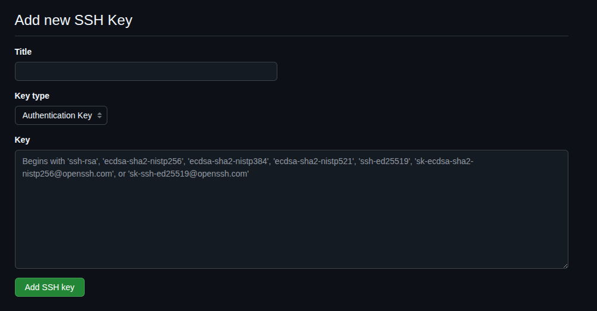

# Basic Steps to Configure SSH-Key with Github

### 1 - Generate a new SSH-Key

Execute the bash-script generate-ssh-keys.sh file like this:

```sh
    ./bash-scripts/generate-ssh-keys.sh NameHere
```

This will generate a couple of files:

* Without extension => Private Key (DO NOT SHARE WITH ANYTHING)
* With extension .pub => Public Key

### 2 - Add Key/s to SSH-Agent

* One to One manually:

```sh
    eval "$(ssh-agent -s)"
    ssh-add /path/to/private/ssh-key
```

* All Automatically:

```sh
    make add-ssh-keys
```

### 3 - Configure SHH-Config File

* Create a file called config
* Inside this file, copy the content of ssh-config-git-template
* Modify values between '<>' by yours values
* Move this file toward path /home/name/.ssh  => This folder is hidden by default

### 4 - Create a new SSH-Key on Github

* On the field "Title" you can write what you want
* On the field "Key Type", give default value: Authentication Key
* On the field "Key", you must add the content of the public key generated on the Step 1



### 5 - Connecting Git with Github using SSH-key

You have two ways:

* Clonning any repo using SHH
* Creating a new Repo using SSH

### 6 - If you are using several github accounts you must configurate git for each repo

You must configurate user.name and user.email with the same credentials as your SHH-Key

On each repository:
    * Open a terminal on the root of the project and configure user.name and user.email

```sh
    git config user.name "Your-Github-User-Name"
    git config user.email "Your-Github-User-Email"
```

---

# Connect Local Repository with Github via SHH

1. Execute command from this repo:

```make
make add-ssh-keys
```

2. First Verification shh-Agent is working fine. Execute:

```make
make show-ssh-keys
```

Should must appear a SHA256 code inidicating the shh-key owner.

3. Second Verification shh-Agent is working fine. Execute:

```bash
ssh -T git@github.com
```

You should get something like the following message which indicate that your ssh-agent and your github account are connected.

```md
Hi <user>! You've successfully authenticated...
```

4. Connect your Local Repository with Github Repository

```bash
git remote set-url origin git@<YourGithubUser>-github:YourUser/your-repo.git
```

If everything is fine, your local repo will be connected to your remote repo succesfully!